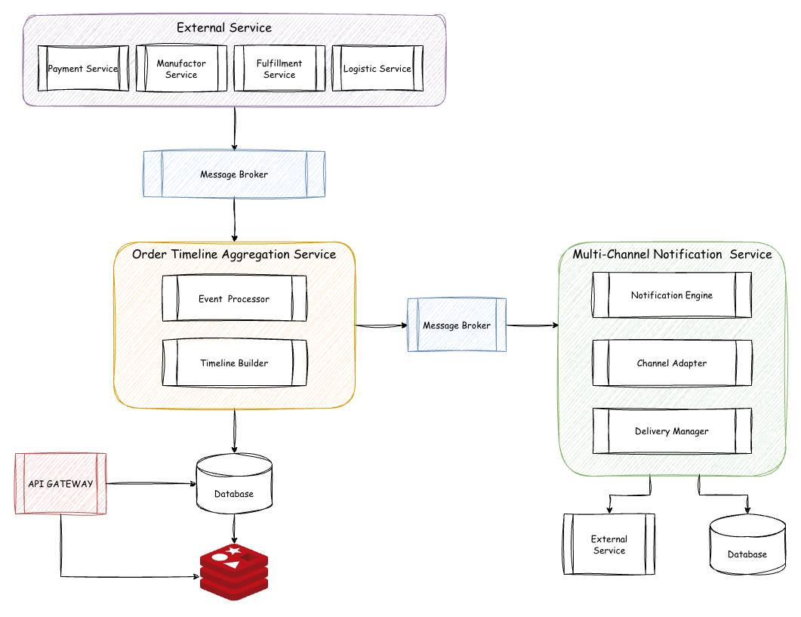
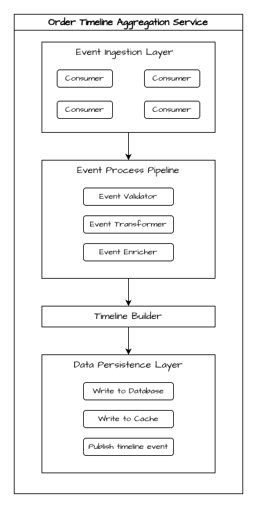
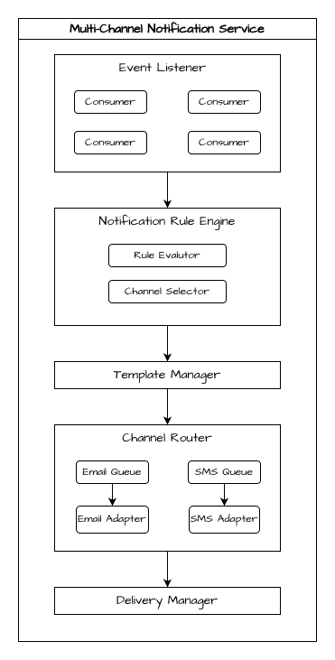
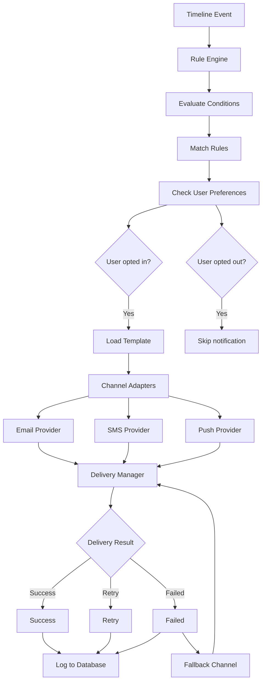

# Phân tích về Case Challenge & Giả định

## Bối cảnh

Teemazing (TMZ) là một công ty chuyên về thiết kế quà tặng cá nhân hóa, bán hàng trên website

## Mục tiêu kinh doanh

Mục tiêu kinh doanh: Giảm 40% số lượng yêu cầu hỗ trợ khách hàng (Customer Support Tickets) liên quan đến “tình trạng đơn hàng” và “thời gian giao hàng” trong quý tới, nhằm cải thiện sự hài lòng và giảm chi phí vận hành

Dựa vào mục tiêu kinh doanh đề ra, các yêu cầu cần focus vào bao gồm: 
- Giảm 40% số lượng yêu cầu hỗ trợ khách hàng liên quan đến 2 chủ đề “tình trạng đơn hàng” và “thời gian giao hàng”
- Giải pháp đưa đưa cần cải thiện sự hài lòng, giảm chi phí vận hành 

## Đặt câu hỏi và đưa ra vấn đề

- Tại sao số ticket về 2 chủ đề này lại nhiều?
- Tại sao khách hàng chưa có sự hài lòng tốt?
- Chi phí vận hành sẽ giảm khi số ticket giảm nên chỉ cần giải quyết được câu hỏi thứ nhất

## Giải quyết vấn đề

### Giả định

- Vấn đề đã được BA hoặc Team Product phân tích dựa trên những số liệu có thật của bộ phận CS, hoặc qua các cuộc điều tra ...vv... (thông thường trong phát triển sản phẩm thì đây là một phase quan trọng để có thể tìm ra gần chính xác nguyên nhân của vấn đề)
- Ở luồng vận hành của CS, khi tiếp nhận yêu cầu hỗ trợ, CS đã có các công cụ để tra cứu và giúp giải quyết các câu hỏi của khách hàng về đơn hàng
- Giả định TMZ đã có các dịch vụ để trả cứu, tracking đơn hàng, các dịch vụ này đã đi vào vận hành và có độ chính xác cao, tuy nhiên về timeline của đơn hàng thì đang không tập trung và phân tác ở nhiều nguồn (nhiều khâu)

### Làm rõ vấn đề

- Thông tin đến khách hàng không chủ động, không kịp thời. Thông thường, khách hàng sẽ yêu cầu hỗ trợ khi đơn hàng của họ lệch so với kì vọng (hẹn giao trễ, trạng thái không đúng kì vọng, thời gian dài mà đơn hàng không chuyển trạng thái) hoặc thậm chí khách hàng không nhận được bất kì thông tin gì về đơn hàng của họ
- Dữ liệu về đơn hàng tồn tại ở nhiều nguồn (nhiều khâu), không được hợp nhất theo timeline dễ hiểu, dẫn đến trải nghiệm không tốt của khách hàng -> khách hàng sẽ yêu cầu hỗ trợ để "hiểu" hơn về đơn hàng của họ 
- Ticket sẽ không giảm bằng cách tối ưu CS mà bằng cách loại bỏ lý do khiến khách hàng phải yêu cầu hỗ trợ 

# Giải pháp

Xây dựng dịch vụ Order Tracking & Notification System

## Tổng quan

Xây dựng một hệ thống tự động theo dõi và thông báo trạng thái đơn hàng cho khách hàng, giúp họ chủ động nắm bắt thông tin mà không cần liên hệ CS

## Các tính năng cốt lõi cần có

1. Order Timeline Aggregation Service

- Chức năng: Tổng hợp tất cả thông tin đơn hàng từ các nguồn khác nhau (payment, fulfillment, manufacture, logistic, ...)

- Yêu cầu kĩ thuật: 
    + Tích hợp với các hệ thống hiện có (các hệ thống đang chưa thông tin về timeline của đơn hàng)
    + Real-time hoặc near real-time data sync
    + Chuẩn hóa dữ liệu về một format thống nhất
    + Event-driven architecture để capture mọi thay đổi trạng thái

2. Multi-Channel Notification Service

- Chức năng: Gửi thông báo tự động cho khách hàng mỗi khi đơn hàng có thay đổi quan trọng

- Kênh thông báo:
    + Email
    + SMS (cho các mốc quan trọng)
    + Push notification
    + In-app notification

- Các sự kiện cần thông báo
    + Đơn hàng được xác nhận
    + Đang sản xuất/in ấn thiết kế
    + Đã hoàn thành sản xuất
    + Đã giao cho đơn vị vận chuyển
    + Đang trên đường giao
    + Dự kiến giao hàng (trước 24h)
    + Đã giao thành công
    + Cảnh báo chậm trễ (nếu có)

## Các yêu cầu phi chức năng

### Perfomance

- Latency <2s cho tracking order
- Notification delivery < 5 phút sau event 

### Reliability:

- 99.9% uptime cho tracking service
- Cơ chế retry khi gửi thông báo lỗi
- Kênh dự phòng nếu một kênh bị lỗi

### Scalability:

- Hỗ trợ tăng trưởng 3-5x số đơn hàng
- Khả năng mở rộng theo chiều ngang (Horizontal scaling capability)

## Thiết kế hệ thống

### Kiến trúc tổng thể



### Order Timeline Aggregation Service - Chi tiết

#### Kiến trúc Component



#### Data Flow

```External System → Kafka → Event Validator → Event Transformer → Event Enricher → Timeline Builder → Persist to Database → Publist timeline event → Notification Service Consumer```

### Multi-Channel Notification Service - Chi tiết

#### Kiến trúc Component



#### Data Flow



### Tech stack

#### Database - PostgreSQL

- Đảm bảo ACID
- JSONB Support
- Advenced Query
- Dễ scale luồng đọc

#### Message Broker - Kafka

- Phù hợp với event sourcing
- High throughput
- Multiple consumer pattern

#### Caching - Redis

- Độ trễ thấp
- Rich data structures (String, Hash, Sorted Set)
- TTL support cho automatic expiration

#### Backend Language - Golang

- High performance
- Native concurrency with goroutines

# Kế hoạch triển khai

## Phase 1: MVP

### Mục tiêu

- Xây dựng luồng Order timeline aggregation
- Email notification cho các mốc timeline quan trọng

### Milestone 1 - Infrastucture setup

PIC: Devops Engineer + Technical Leader

Deliverables:
- Kafka cluster hoạt động với các topic chứa thông tin về đơn hàng, được produce từ các external service
- Database schema deployed
- Redis cluster
- CI/CD pipeline
 
### Milestone 2 - Event Processing Pipeline

PIC: Backend Engineer

Deliverables:
- Kafka consumer implementation
- Event Processor service với 3 components (Validator, Transformer, Enricher)

### Milestone 3 - Timeline Builder & State Manager

PIC: Backend Engineer

Deliverables:
- Timeline Builder implementation
- State Snapshot
- Rest API cho truy vấn order timeline

### Milestone 4 - Multi-Channel Notification Service - Email Only

PIC: Backend Engineer

Deliverables:
- Kafka consumer các mốc timeline quan trọng:
    + Order confirmed
    + Manufacturing started
    + Manufacturing completed
    + Order shipped
    + Order delivered
- Triển khai các component của Multi-Channel Notification Service chỉ với Email Channel

## Phase 2: SMS Notification

### Mục tiêu

- SMS Notification

### Milestone 1 - Multi-Channel Notification Service - SMS

PIC: Backend Engineer

Deliverables:
- Triển khai các component của Multi-Channel Notification Service với SMS Channel
